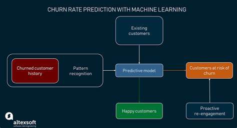

# Customer-churn-Prediction

## Table of Contents
- [Project Overview](#project-overview)
- [Project Objective](#project-objective)
- [Data Sources](#data-sources)
- [Data Preprocessing](#data-preprocessing)
- [Machine Learning Model](#machine-learning-model)
- [Evaluation Metrics](#evaluation-metrics)
- [Key Insights](#key-insights)
- [Conclusion](#conclusion)

## Project Overview
The "Customer Churn Prediction using Machine Learning" project aims to develop a robust system capable of identifying customers at risk of churn. By leveraging advanced analytics and machine learning techniques on the provided dataset, and providing recommendations to the company, the aims is to implement targeted retention initiatives to reduce customer attrition, enhance customer loyalty, and maintain a competitive edge in the telecommunications industry.

## Project Objective
The objective is to accurately forecast which customers are likely to churn (i.e. discontinue their services) based on historical customer data. 

## Data Sources
 The data used in this project was from kaggle. The dataset contains a collection of features including	gender, SeniorCitizen, Partner, Dependents, tenure,	 PhoneService, MultipleLines, InternetService, OnlineSecurity, OnlineBackup,	 DeviceProtection, TechSupport, StreamingTV, StreamingMovies, Contract,	 PaperlessBilling, PaymentMethod, MonthlyCharges, TotalCharges, Churn

## Data Preprocessing
 Before feeding the data into the machine learning model, extensive data preprocessing was performed. This included handling missing datas, scaling features. Additionally, feature engineering techniques were applied to extract relevant iformation from the raw data such as the short, medium and long term tenure.

 ## Machine Learning Model 
 The customer churn prediction is built using a supervised machine learning approach. Training and test was split into 70:30. Several algorithms were experimented with including but not-limited to:
 - Random Forest
 - Naive Bayes
 - Support Vector Machine
 - Xgboost 

   After extensive experimentation and hyperparameter tuning, the final machine learning model was selected based on its performance and generalization capabilities

 ## Evaluation Metrics
   To assess the performance of the machine learning model , the evaluation metrics mere used:
   - Precision : The proportion of correctly identified churned customers among all instances classified as churned
   - Recall : The proportion of correctly identified  churned customers among all actual instances of churned customers
   - F1 Score: The harmonic mean of precision and recall providing a balanced metric for model evaluation
   - Accuracy : The poverall proportion of correctly classified churned customers

  ## Key Insights
  - The purpose of this project is to predict customer churn behaviour
  - The best model that predicts with lesser error is to be chosen , subjecting them to the different evaluation metrics including k-fold cross validation (accuracy, precision and recall)
  - The confusion matrix displays the error value for each model in terms of False Positive(where the model predicts a customer to be at risk when they actually not at risk ) and False Negative(where the model predicts a customers retention when they are actually at risk ). The FN should be properly addressed because , a high FN result to false prediiction of customer retention and missing out the real customers at risk.
  - After cross validation , the model with the highest F1 score will be deployed . F1 score is the most relevant matrix in this business problem. This is because the f1 score is the mean of both the precision and recall.  

## Conclusion
The "Customer churn prediction using Machine Learning " project showcases the effectiveness of machine Learning algorithms in identifying customers at risk of churning . By accurately identifying and preventing customers from churning , this model enhances the business sustainability and growth. Xgboost classifier has the highest F1 score compared to other models . Hence it should be deployed by ConnectTel for customer churn predictive behavior as it has 72% recall and 79% accuracy.

